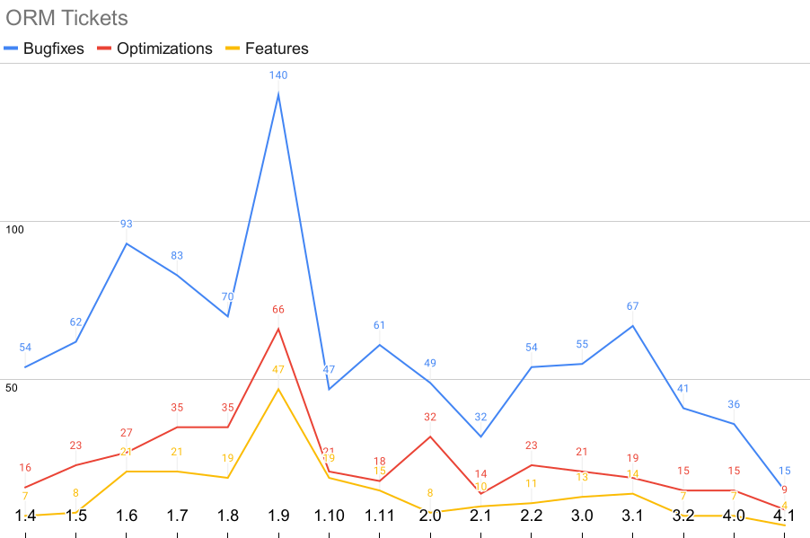
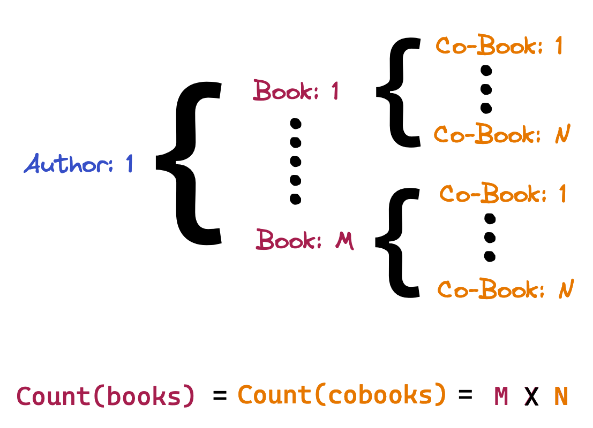

<style scoped>
    h1 {
        margin-top: 20%
    }
</style>

# State of the ORM

### Review of the past and future of `django.db.models`

by Simon Charette

<!--
Thanks Logan!
-->

---


## Simon Charette

- Montréal, Canada
- Django contributor for ~10 years
    -   Mostly to the ORM and migrations
- Staff Eng. at Zapier

:email: charettes@gmail.com
:octopus: github.com/charettes

---

<style scoped>
    ul {
        margin-top: 30%
    }
</style>


- _No Code_ automation tool
- 5000+ integrations
- Multiple Python & Django services
- Extensive usage of the ORM against MySQL and PostgreSQL

<!--
- Mission of the product is not Make Automation Work for Everyone
- 700 people accross 40 countries all remotely
-->

---

## What is the ORM?

- **O**bject–**r**elational **m**apping
- Definition of model relations mapping to database tables
- Allow for retrieval and update of data
  - `QuerySet.filter()`, `.all()`, `.get()`
- Abstraction layer between Python and databases
  - Speaks SQL
  - Maps table rows to Python objects

---

## Evolution or the ORM

- Review of some of the most influential changes in the past 10 years
- Technical dive into issues that remains unsolved, lacking
- What lies ahead and how to get there

---

## Pick of most influential features
- A bit of Git-Trac archeology from 1.4 to 4.1
- Perceived momentum to contributions
- Hard to imagine the ORM without them nowadays

<!--

-->

---

#### `prefetch_related` multi-valued relationship fetching
##### Django 1.4 (2012)
- Refactor of relation caching in 1.5
- Proper interactions with `select_related`
- Enhanced with `Prefetch`, `to_attr` in 1.7
- `prefetch_related_objects` made public in 1.10
- Slicing support should land in Django 4.2 🤞
- Still lacking support for `QuerySet.values`

<!--
- Hard to imagine Django without `prefetch_related` support that Luke Plant worked on.
- Single query fetching
- All of the fetching and caching of multi-valued relationships had to be done manually
- Excluding the great number of bugs and enhancements
- Incremental delivery of feature enhancements
-->

---

#### `transaction.atomic` improved transaction management
##### Django 1.6 (2013)
- Large and complex refactor
- Made transaction handling understandable
- Saner public API `transaction.atomic` thanks to `@Xof/xact`
- Default to auto-commit
- `transaction.on_commit` hook


<!--
- Thanks to the hard work of Aymeric Augustin and inspiration of Christophe Pettus
Clearly defined expectations of the public (managed) API and the off-road expectations
Auto-commit usually makes more sense in the context of a web framework that has more read and defaults to 
-->

---

#### `Lookup`, `Transform`, and `Expression` support
##### Django 1.7, 1.8 (2014-15)
- Liberalized access to the ORM
- Formalized APIs `resolve_expression`, `as_sql`
- Most of usages of `extra` were made obsolete

<!--
- Long standing dragons we litteraly tamed thanks to Josh Smeathon and Anssi Kääriäinen
- Finally
- 
-->

---

<style scoped>
    img {
        margin-left: 10%;
        display: block;
        width: 80%;
    }
</style>





---

#### `Subquery`, `Exists`, and `FilteredExpression`
#### Django 1.11, 2.0 (2017)
- Push the concept of expressions further with `OuterRef`
- More control into `JOIN` and nested queries generation
- Made *even more* usages of `extra` usage obsoletes
- Legitimate performance improvements
- Necessary ways to circumvent long standing ORM limitations

<!--
- Validate the concept of expressions and query resolving
-  Expressions support V2

-->

---

#### `Model.Meta.constraints` and friends
#### Django 2.2-4.1 (2019-22)
- Functional indexes in 3.2
- Functional unique constraints in 4.0
- `Constraint.validate` in 4.1
- Eventual deprecation of `unique_together`
- Possibilty to revisit model validation of constraints

<!--

Required internal machinery rework to allow resolving expressions against 
Mapping of IntegrityError to ConstraintViolation(constraint) could
change how model validation is performed
-->

---

# <!-- fit --> Long standing issues / missing features

<style scoped>
    li {
        font-size: 40px;
        padding: 10px;
    }
</style>

- Multi-valued relationship handling ([#2361](https://code.djangoproject.com/ticket/2361))
- Relation fetching strategies ([#28586](https://code.djangoproject.com/ticket/28586))
- Reusable relationship definitions

---

## Multi-valued relationship handling

<style scoped>
    code {
        font-size: 30px;
    }
</style>

```python
class Author(Model):
    name = CharField(max_length=100)
```

```python
class Book(Model):
    title = CharField(max_length=100)
    author = ForeignKey(
        Author, CASCADE, related_name="books"
    )
    coauthor = ForeignKey(
        Author, CASCADE, related_name="cobooks", null=true
    )
```

<!--

-->

---


<!--
From the Book's perspective its relationship is single-valued as it can have a single author
-->

---


---


## Multi-valued relationship handling

<style scoped>
    code {
        font-size: 35px;
    }
</style>

```python
>>> Author.objects.filter(books__title__icontains="ring")
[
    <Author: "J. R. R. Tolkien">,
    <Author: "J. R. R. Tolkien">, ...
]
```

```sql
SELECT author.*
FROM author
INNER JOIN book ON (book.author_id = author.id)
WHERE book.title ILIKE '%ring%'
```

<!--
- `JOIN` results in duplicate rows; many books per author
- Usually worked around by using `distinct()`;  `SELECT DISTINCT`
-->

---

## Multi-valued relationship handling

<style scoped>
    code {
        font-size: 30px;
    }
</style>

```sql
WHERE EXISTS(
    SELECT 1 FROM book
    WHERE book.author_id = author.id AND book.title ILIKE '%ring%'
)
```

instead of

```sql
INNER JOIN book ON (
    book.author_id = author.id
    AND book.title ILIKE '%ring%'
)
```

---

## Multi-valued relationship handling

Desirable for aggregation purposes

<style scoped>
    code {
        font-size: 30px;
    }
</style>

```python
>>> Author.objects.annotate(books_cnt=Count("books"))
[<Author: "J. R. R. Tolkien">, ...]
>>> _[0].books_cnt
>>> 5
```


```sql
SELECT author.*, COUNT(book.id)
FROM author
INNER JOIN book ON (book.author_id = author.id)
GROUP BY author.id
```

---

## Multi-valued relationship handling

<style scoped>
    code {
        font-size: 25px;
    }
</style>

As long as only a single multi-valued relationship is involved ([#10060](https://code.djangoproject.com/ticket/10060))

```python
>>> Author.objects.annotate(
    books_cnt=Count("books"),
    cobooks_cnt=Count("cobooks"),
)
[<Author: "J. R. R. Tolkien">, ...]
>>> _[0].books_cnt, _[0].cobooks_cnt  # COUNT(book.id) X COUNT(coobook.id)
```


```sql
SELECT author.*, COUNT(cobook.id), COUNT(book.id) FROM author
INNER JOIN book ON (book.author_id = author.id)
LEFT JOIN book cobook ON (cobook.author_id = author.id)
GROUP BY author.id
```

---


## Multi-valued relationship handling

<style scoped>
    img {
        width: 60%;
        margin-left: 10%;
    }
</style>



---

## Multi-valued relationship handling

Makes aggregation through this method a :foot: :gun:

- Possible to work around for `COUNT` by using `DISTINCT`
- Not possible for aggregate that don't support `DISTINCT`
- Possible to work around using subqueries ([#28296](https://code.djangoproject.com/ticket/28296))


<!--
- Sometimes hard to diagnose issue due as it depends on the dataset
-->

---

## Multi-valued relationship handling

<style scoped>
    li {
        font-size: 32px;
    }
</style>

##### Possible solutions (mostly backward incompatible)

- Warn or error when multiple multi-valued relationships are involved
- `GROUP BY` even when no aggregation is involved
- Disallow multi-valued relationships filtering
   - e.g. require explicit `__exists` lookup instead
- Teach the ORM to be smart enough to use subqueries when appropriate (some database have performance issues with subqueries e.g. MySQL)

---

## Limited support for field fetching strategies
##### Current situation
- Relations are deferred by default (opt-in via `select_related`)
- Fields are selected by default (opt-out via `defer` / `only`)

---

## Limited support for field fetching strategies

<style scoped>
    code {
        font-size: 32px;
    }
</style>

```python
class Author(Model):
    name = CharField(max_length=100)

class Book(Model):
    title = CharField(max_length=100)
    author = ForeignKey(Author, CASCADE, related_name="books")

>>> Book.objects.all()
```

```sql
SELECT book.id, book.title, book.author_id FROM book
```

---

## Limited support for field fetching strategies

<style scoped>
    code {
        font-size: 32px;
    }
</style>

```python
>>> book = Book.objects.get(id=1)
>>> book.author
<Author: Tolkien>
```

```sql
SELECT book.id, book.title, book.author_id
FROM book WHERE id = 1
-- Assuming Book(id=1).author_id == 2
SELECT author.id, author.name
FROM author WHERE id = 2
```

---

## Limited support for field fetching strategies

<style scoped>
    code {
        font-size: 32px;
    }
</style>

```python
>>> book = Book.objects.select_related("author").get(id=1)
>>> book.author  # Attribute already fetched
<Author: Tolkien>
```

```sql
SELECT
    book.id, book.title, book.author_id, author.id, author.name
FROM book
INNER JOIN author ON (book.author_id = author.id)
WHERE id = 1
```

---

## Limited support for field fetching strategies

<style scoped>
    code {
        font-size: 32px;
    }
</style>

```python
>>> book = Book.objects.defer("title").get(id=1)
>>> book.title
"The Hobbit"
```

```sql
SELECT book.id, book.author_id
FROM book
WHERE id = 1
---
SELECT book.title
FROM book
WHERE id = 1
```

---

## Limited support for field fetching strategies

<style scoped>
    code {
        font-size: 32px;
    }
</style>

#### `N+1` query problem
```python
>>> for book in Book.objects.defer("name"):
>>>     book.author, book.name  # Triggers two queries!
```

```sql
SELECT book.id, book.author_id FROM book
--- Repeat the following queries for each book (N times)
SELECT author.id, author.name FROM author WHERE id = 2
SELECT book.title FROM book WHERE id = 1
--- ...
```

---

## Limited support for field fetching strategies

#### Current (core) mitigations

- Extensive code coverage relying on `assertNumQueries`
- Monitoring # of queries per request through middleware
- `django-debug-toolbar` SQL panel

<!--
While there are many third party solutions and inhouse tricks to tame this issue the in-core 
-->

---

## Limited support for field fetching strategies
### Possible mitigations
#### Automatically _prefetch_ when `N+1` pattern is detected

- Automatically prefetch related for "to one" fields ([#28586](https://code.djangoproject.com/ticket/28586))
- [tolomea/django-auto-prefetch](https://github.com/tolomea/django-auto-prefetch)
- [django/django#16090](https://github.com/django/django/pull/16090)

---

## Limited support for field fetching strategies
#### Automatically _prefetch_ when `N+1` pattern is detected

<style scoped>
    code {
        font-size: 32px;
    }
</style>

```python
>>> for book in Book.objects.all():
>>>     book.author
```

```sql
SELECT book.id, book.author_id FROM book
---
SELECT author.id, author.name FROM author
WHERE id IN (...)
```

<!--
A lazy `prefetch_related("author")` only triggered if necessary if there are multiple peers
-->

---

## Limited support for field fetching strategies
#### Automatically _prefetch_ when `N+1` pattern is detected

**Cons**

- `prefetch_related` doesn't enforce referential integrity; state can change between separate queries ([#27403](https://code.djangoproject.com/ticket/27403))
- Encourage lax practices in terms of data access pattern

<!--
The summary is that prefetch related is not always a good default, could cause more harm than good in some situations
-->

---

## Limited support for field fetching strategies
### Possible mitigations
#### Warn on deferred attribute fetching

- Log, warn, or error on implicit queries
- [dabapps/django-zen-queries](https://github.com/dabapps/django-zen-queries)
- [charettes/django-seal](https://github.com/charettes/django-seal)

---

#### Warn on deferred attribute fetching

<style scoped>
    code {
        font-size: 32px;
    }
</style>

```python
>>> for book in Book.objects.all():
>>>     book.author

LazyAttributeAccess:
    Attempt to fetch deferred relationship "author"
```

```python
>>> for book in Book.objects.defer("title").all():
>>>     book.title

LazyAttributeAccess:
    Attempt to fetch deferred field "title"
```

<!--
- At Zapier we used this tool to help with the creation of GraphQL endpoint
- We turn violations into warnings elevated to exceptions when running our test suite and direct warnings in production to a particular logging facility
- This ensures we don't regress when adjusting our endpoints without litering out test suite with tons of `assertNumQueries`
-->

---

## Limited support for field fetching strategies
### Possible mitigations
#### Warn on deferred attribute fetching

**Cons**

- Doesn't actually solve the problem, only points at its origin
- Requires opt-in to maintain backward compatiblity

<!--
- Opt-in might be required as lazy fetching might be legitimate in some circumstances (e.g. expensive JOIN)
-->

---

## <!-- fit --> Limited support for field fetching strategies
#### Thinking of a generic solution

- SQLAlchemy `lazy` field option allows for defining a per-field strategy
- Could we have a similar strategy that allows for third-party customization. e.g. `Field.on_fetch`/`fetch_policy`?
- Focus should be on providing an entry point at first
- [Discussed in 2013 on django-developers](https://groups.google.com/g/django-developers/c/C3qoHEfeeUg/)

---

### Reusable relationship definitions

- Some relationship between models are not expressible through concrete related fields
- `FilteredRelation` helped to a certain extent but requires a pre-existing relationship
- [alexhill/django-relativity](https://github.com/alexhill/django-relativity)
- [akaariai/django-reverse-unique](https://github.com/alexhill/django-relativity)

---

### Reusable relationship definitions

<style scoped>
    code {
        font-size: 35px;
    }
</style>

```python
class Book(Model):
    date = DateField()
    same_year = ManyToManyRel(
        "self", Q(date__year=F("date__year"))
    )
    translation = ManyToOneRel(
        "translations", Q(translations__language=get_language)
    )

class Translation(Model):
    book = ForeignKey(Book, CASCADE, related_name="translations")
    language = CharField(max_length=2)
    content = TextField()
```

<!--
Lot of the required machinery is already existing, it powers reverse relationships
It would allow to make virtual relationships first-class citizen in the ORM instead of hacks to support generic relationships
-->

---

### Reusable relationship definitions

<style scoped>
    code {
        font-size: 28px;
    }
</style>

```python
>>> Book.objects.annotate(
    Count("same_year")
).select_related("translation")
```

```sql
SELECT book.*, COUNT(same_year.id), translation.* FROM book
LEFT JOIN book same_year ON (
    EXTRACT(YEAR from book.date) = EXTRACT(YEAR from same_year.date)
)
LEFT JOIN translation ON (
    translation.book_id = book_id AND translation.language = "fr"
)
GROUP BY book.id
```

---

### Reusable relationship definitions

- Improve code reusability through model defined alias
- Much easier to reason about complex data models
- Support for `select_related` and `prefetch_related`
- Inherit relationship caching

---

### Few of many issues in a similar situation

- Composite primary keys
- Support for multi-valued `select_related` (e.g. `JSON_ARRAYAGG`)
- Generated fields
- `Field.db_default`
- `Field.db_on_delete`

---

# Current state of things

- Long commitment required to see changes through
- New features often comes with a long tail of regressions
- Small number of individuals are able review ORM changes
- Some issues are stalled due to lack of consensus, diversity
- ORM is perceived as this undecipherable part of Django

<!--
Some issues take a while to wrap your head around, recently fixed an issue I worked on and off over 8 years
-->

---

<style scoped>
    img {
        margin-left: 10%;
        display: block;
        width: 80%;
    }
</style>


<!--
Take the diagram with a brain of salt as contribution attributions goes beyond commit author assignment (talks, tutorial, etc) but it does have the benefit of being easily countable.
-->

---

# Possible ways forward
## Document ORM internals 📄
- Define expected beaviour beyond test suite
- Highlight currently undefined behaviour
- Diagram relationships between features
- Re-discover and formalize reasoning behind years old decisions

<!--
- Produce more high quality documentation on the subject
- Documentation with a disclaimer; it doesn't have to come with the same backward compatibility guarantee at least until things stabilize
-->

---

# Possible ways forward
## Add `typing` to `django.db.models` internals
- Evaluate tradeoffs of `DEP 0484: Static type checking for Django`
- Matured ecosystem, `typing.Protocol` supports align with _resolvable_ and _compilable_ duck-typing
- IDE supports makes code base more approachable
- Reduce long tail of `TypeError`, `AttributeError` on new feature addition

<!--
- Previously opposed to DEP four-eighty-four
- Could allow maintainers to dip their toes in `typing` code without getting our of hands gradually. 
-->

---

# Possible ways forward
## Mentoring 👨‍🏫
- Released based mentoring
- Focus on incremental improvements and refactors
- Onboard contributors in a release cycle

<!--

-->

---

## Thanks! 🙇‍♂️

- Happy to discuss further off stage and during sprints

<!--
Thanks to everyone who reviewed this talk and I'm looking forward to discuss the state of the ORM further off stage and during the sprints on Thursday.
-->